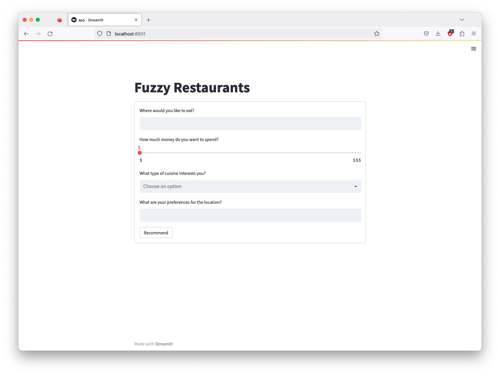

# Installation

To install required packages, run the following line in terminal:

```bash
pip install -r requirements.txt
```

It is recommended to use a virtual environment.

# Run 

To use application, go to the project directory and run the following line in terminal:

```bash
streamlit run demo.py
```

The application should automatically open in a new tab in your browser.

# Dataset

The dataset comes from [Kaggle](https://www.kaggle.com/datasets/damienbeneschi/krakow-ta-restaurans-data-raw) and consists of information on restaurants in 31 European cities. The original file (name) consists of 125,433 entries and is structured as follow:

* **Name** - name of the restaurant
* **City** - city location of the restaurant
* **Cuisine Style**: cuisine style(s) of the restaurant, in a Python list object (94 046 non-null)
* **Ranking** - rank of the restaurant among the total number of restaurants in the city as a float object (115 645 non-null)
* **Rating** - rate of the restaurant on a scale from 1 to 5, as a float object (115 658 non-null)
* **Price Range** -  price range of the restaurant among 3 categories , as a categorical type (77 555 non-null)
* **Number of Reviews** - number of reviews that customers have let to the restaurant, as a float object (108 020 non-null)
* **Reviews** - reviews that are displayed on the restaurants scrolling page of the city, as a list of list object where the first list contains the 2 reviews, and the second le dates when these reviews were written (115 673 non-null)
* **URL_TA** - part of the URL of the detailed restaurant page that comes after `www.tripadvisor.com` as a string object (124 995 non-null)
* **ID_TA** - identification of the restaurant in the TA database constructed a one letter and a number (124 995 non-null)

Missing information for restaurants (for example unrated or unreviewed restaurants) were labeled as `NaN` (`numpy.nan`).

## Preprocessing

The dataset was processed as `pandas.DataFrame`. First, all missing values were removed, resulting in 74 225 items left in the collection. All column names have been changed to lower case, and spaces replaced with `_`.

Based on the `city` column, two more columns were added - `latitude` and `longitude`, which contain information about the city's geographic coordinates.

The values from the `cuisine_style` column were converted from `String` type to a list of cuisine style names.

The restaurant rating was recalculated as the quotient of `rating` and `number_of_reviews` according to the following formula:

$$ \text{new\_rating} = \frac{\text{rating}}{\text{number\_of\_reviews}} $$

The price range was transformed to numerical values according to the following formula:

$$
\text{price\_range} = \begin{cases} 
    \$ & \to 0 \\ 
    \$\$-\$\$\$ & \to 0.5 \\ 
    \$\$\$\$ & \to 1.0 
\end{cases}
$$

All reviews were cleaned of unnecessary characters and then encoded using the `sentence-transformers/all-MiniLM-L6-v2` model to obtain sentence embeddings. This made it possible to obtain the data necessary for semantic comparison of sentences.

Columns `ranking` and `number_of_reviews` were removed and processed dataset was saved as `pickle`.


# Demo
A demo version of the system was created using the Streamlit package. Using a graphical interface, the user can specify:
* city or address (text input),
* price range (slider),
* cuisine style (multiselect),
* personal preferences (text input).



The cuisine style is then vectorized using the `CountVectorizer` from the `scikit-learn` package created earlier based on a list of all available styles. This vectorizer was chosen because it counts the occurrences of a word in the text, and no cuisine style can be selected twice. As a result, we get a vector containing only 0's and 1's, which we then compare with similarly created vectors of cuisine styles for all restaurants, getting a cosine similarity.

The user's personal preferences are, like restaurant reviews, encoded using the `sentence-transformers/all-MiniLM-L6-v2` model to get sentence embeddings. These are then compared with the embeddings of all restaurant reviews, obtaining cosine similarity.

All values are then transformed into a user preference vector composed of values:
- latitude of the location based on the city or address specified earlier, normalized by dividing by the maximum latitude value appearing in the dataset,
- the longitude of the location based on the city or address specified earlier, normalized by dividing by the maximum longitude value appearing in the dataset,
- `1.0` as the highest possible cosine similarity value, representing the similarity of the cuisine style vector,
- `0.0` as the highest possible rating for a given restaurant,
- the price range was transformed to numerical values according to the already presented formula:

$$ 
\text{price\_range} = \begin{cases} 
    \$ \to 0 \\ 
    \$\$ \to 0.5 \\ 
    \$\$\$ \to 1 
\end{cases} 
$$

- `1.0` as the highest possible cosine similarity value, representing the semantic similarity of user preference and restaurant reviews.

It is worth noting that for demonstration purposes, the dataset has been reduced to improve system performance, according to the following table:

| Name   | Size           | Time    |
| ------ | -------------- | ------- |
| tiny   | 1 550 entries  | 4.62 s  |
| small  | 16 572 entries | 35.3 s  |
| medium | 31 674 entries | 64.88 s |
| large  | 71 181 entries | ?       |